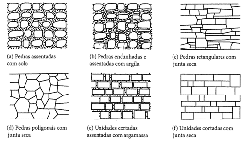
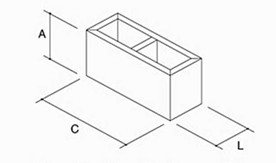
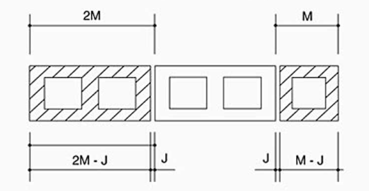

# HISTÓRICO E CONCEPÇÃO ESTRUTURAL DE SISTEMAS DE PAREDE AUTOPORTANTE

<p style='text-align: justify;'>A história das estruturas civis é tão antiga quanto a história da humanidade. Sobre essa ótica deve-se lançar um olhar aos tempos mais remotos das civilizações podendo assim verificar o uso de estruturas de pedra e barro solidificado para criação de templos e moradias.</p>  

<p style='text-align: justify;'>Grandes construções como as pirâmides do Egito Antigo, Taj Mahal e Muralha da China foram erguidas com a utilização de técnicas de construção em alvenaria autoportante [1]. A sociedade Americana do Construtores de Alvenaria [2] afirma que os blocos de barro cozidos ao sol já eram utilizados como material estrutural a cerca 6000 de anos atrás.</p>  

<p style='text-align: justify;'>Em um primeiro momento as formas estruturais eram compostas por junções simples de colunas e vigas e essa concepção evoluiu para as pirâmides e elementos de arco. Casos emblemáticos podem ser citados como as pirâmides do Complexo de Gizé (Egito), Pirâmide de Chichén Itzá (México) e o Palácio de Ctesifonte (Iraque). A Figura 1 apresenta construções tradicionais com o uso de rochas e dos tijolos de adobe.</p>  

    
Figura 1 - Utilização de adobe e rochas em construções. Disponível em: br.pinterest.com acessado em 21/08/2020.

<p style='text-align: justify;'>Então a evolução natural do processo construtivo em alvenaria autoportante se deu com o uso da pedra, dos tijolos de adobe, blocos sílico-calcários até os blocos de concreto de alto desempenho que se conhece atualmente.</p>

<p style='text-align: justify;'>A Figura 2 apresenta alguns modelos de paredes autoportantes formadas pela junção de blocos com ou sem argamassa que eram usadas na antiguidade. Parsekian et al. [3] afirma que as sociedades antigas utilizavam nessas construções a areia como elemento abrasivo para lixar e tornar planas as faces a serem assentadas.</p>

  
Figura 2 - Modelos de assentamento de alvenaria de pedra [3].

## Um pouco sobre a concepção do sistema estrutural

<p style='text-align: justify;'>Qualquer que seja o sistema estrutural estabelecido o engenheiro de projeto deverá detalhar uma estrutura que atenda requisitos de serviço, segurança e robustez [4,5].</p>  

<p style='text-align: justify;'>Nos dias atuais o projeto de edifícios em alvenaria autoportante pode possuir diversificados formatos estruturais, porém pode-se classificar de duas maneiras:</p>
1. Alvenaria não armada;  
2. Alvenaria Armada: Aqui o projetista poderá optar por um sistema composto por armadura passiva ou ativa (por meio de uso da protensão).  

<p style='text-align: justify;'>Independentemente do método escolhido o arranjo estrutural é fortemente dependente da arquitetura e vice-versa visto que as paredes de vedação são partes componentes do sistema estrutural. Tal fato não ocorre com essa intensidade nos problemas relacionados ao concreto armado pela condição que o sistema estrutural pode ser de certa forma parcialmente desconectado do posicionamento das paredes.</p>

<p style='text-align: justify;'>Sobre o contexto anteriormente descrito pode ser levantada as questões relacionadas a modulação da arquitetura. Logo em projetos com essas características engenheiros e arquitetos devem ter uma “sintonia fina” para que o conjunto arquitetura/estrutura atenda todos os critérios projetuais.</p>

<p style='text-align: justify;'>Ramalho e Corrêa [6] afirmam que é essencial nos projetos de alvenaria estrutural a modulação. Tal requisito permitirá que a estrutura seja executada de forma racional e econômica. Apontar uma dimensão modular do comprimento (múltiplos de C) do bloco (Figura 3) afastará problemas de dimensionalidade relacionada a medidas especiais para correção do comprimento que certamente impactaram de forma negativa do projeto de uma parede autoportante em alvenaria.</p>

  
Figura 3 - Dimensões de um bloco [6].

<p style='text-align: justify;'>Por exemplo escolhendo um bloco de 15 cm as medidas internas em planta deverão ser múltiplas de 15 cm. Assim, pode-se ter 60 cm, 1,20 m, 2,10 m. A mesma abordagem pode ser utilizada para o bloco de 20 cm resultando em dimensões de 60 cm, 1,60 m, 2,80 m [6]. Salienta-se aqui que a modulação em elevação também segue os mesmos critérios, porém deverá ser avaliada a dimensão (A) do bloco.</p>

<p style='text-align: justify;'>Sobre o contexto anteriormente descrito pode ser levantada as questões relacionadas a modulação da arquitetura. Logo em projetos com essas características engenheiros e arquitetos devem ter uma “sintonia fina” para que o conjunto arquitetura/estrutura atenda todos os critérios projetuais.</p>

<p style='text-align: justify;'>Ramalho e Corrêa [6] apresentam um exemplo básico de modulação básico para alvenaria estrutural considerando sistema com meio bloco (M) e o bloco inteiro (2M). Logo em uma modulação do tipo M=15 cm deverá se desconsiderar o valor da Junta (J) que em projetos correntes é de 1 cm. Portanto em uma modulação de 15 cm o bloco terá dimensão nominal de 14 cm. A Figura 4 apresenta o esquema de modulação em planta.</p>

  
Figura 4 – Dimensões reais e dimensões nominais [6].

# MATERIAIS

<p style='text-align: justify;'>Para execução de alvenaria estrutural, a composição e materiais empregados deve estar dento do padrão estabelecidos em norma, assegurado a estabilidade e segurança estrutural da edificação [7] de forma a cumprir os requisitos estabelecidos por norma.</p>

<p style='text-align: justify;'>Os blocos cerâmicos estruturais por definição segundo deve possuir furos prismáticos perpendiculares à face que os contêm, sendo os mesmos produzidos para serem assentados com furo na vertical [8]. Os blocos cerâmicos são classificados em: bloco cerâmico estrutural de paredes vazadas (a); bloco cerâmico estrutural com paredes maciças (b); bloco cerâmico estrutural com paredes maciças (paredes internas vazadas) (c) e bloco cerâmico estrutural perfurado (d), como mostra a Figura 5.</p>

  
Figura 5 – Tipologia de blocos de alvenaria estrutural [8].

<p style='text-align: justify;'>Alguns dos requisitos para determinação da qualidade de um lote de blocos são descritos a seguir.</p>

## Identificação e aparência visual dos blocos

<p style='text-align: justify;'>Para identificação dos blocos cerâmicos assim como define Parsekian et al. [3], deve-se durante a fabricação do bloco gravar-se em baixo o alto relevo as informações: a) identificação da empresa; b) Dimensões em centímetros (cm), em seguida largura (L), altura (H) e comprimento (C), (L x H x C), não sendo necessária a inserção da unidade de medida (cm); c) As letras EST (indicativo da sua condição estrutural); e d) indicação de rastreabilidade (número ou sigla que identifique o lote de fabricação.</p>

## Resistência mecânica do bloco

<p style='text-align: justify;'>A principal característica de um bloco é a sua resistência característica a compressão (fbk). Essa é fundamental para cálculo da resistência da parede (fk), sendo o material do bloco e a sua resistência fatores predominantes na resistência a compressão de uma parede. Ainda que as outras características sejam também de fundamental importância, a qualidade de um bloco é na maioria das vezes medida pela sua resistência à compressão.</p>

<p style='text-align: justify;'>Segundo Parsekian et al. [3] para blocos estruturais a resistência mínima é de 3,0 MPa, onde recomenda-se a utilização de blocos mais resistente para caso de alvenaria aparente. A resistência usual do mercado é de 6,0 MPa podendo encontrar blocos de resistência que vão até 18 a 20 MPa.</p>

<p style='text-align: justify;'>Para obtenção deste parâmetro é necessário executar o ensaio de um conjunto de amostra de blocos. Devendo os blocos serem submetidos a saturação, através de imersão em água por pelo menos seis horas. A determinação da resistência característica (fbk) dos blocos ensaiados pode ser calculada pelas equações descritas abaixo.</p>


Caracter | Permissão
---------|----------
`r`      | Permissão de leitura (*read*)
`w`      | Permissão de escrita (*write*)
`x`      | Permissão de execução (*execute*)
`-`      | Permissão desabilitada

Quadro perfil: Perfil dos voluntários do experimento

|Vol.|Formação acadêmica           |Experiência c/ Latex| Expeiência c/ Markdown|
|:-:|:----------------------------:|:------------------:|:---------------------:|
|1  |Ciência da Computação         |ShareLatex          |    Readme/Github      |
|2  |Engenharia da Computação      |Viu prof. utilizando|         -             |
|3  |Engenheiro elétrico (mestrando)|Utiliza para tudo  |         -             |

Fonte: Autor.
    
```
x <- rnorm(n = 10, mean = 100, sd = 5)
hist(x, main = "")
```
